footer: Rijk van Zanten • Major Studio 1 • 9/2018
slidenumbers: true

# Calendar Integration

---

## Apple Calendar

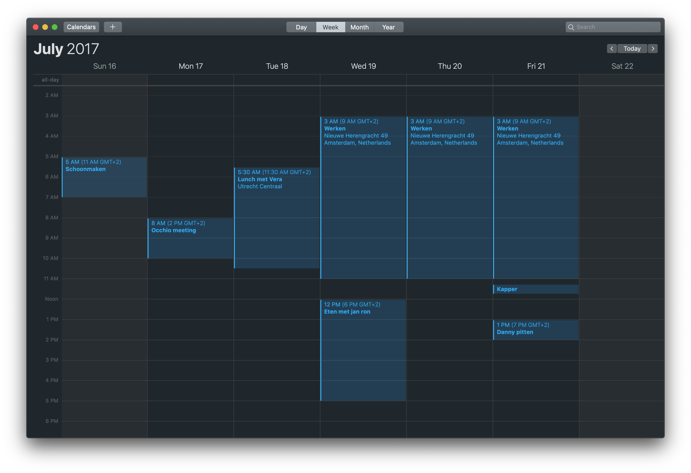

---

## Problem Definition

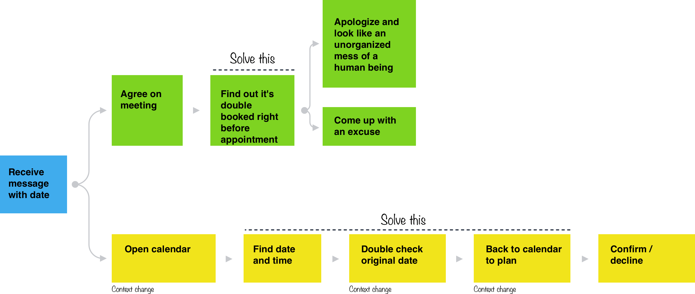

---

## Existing solution

---

## Design Challenge

> How can a email application be extended in a way that allows the user to immediately check date and time availability in order to prevent double bookings from happening and in order to speed up and simplify the planning process?

---

## Primary User Persona

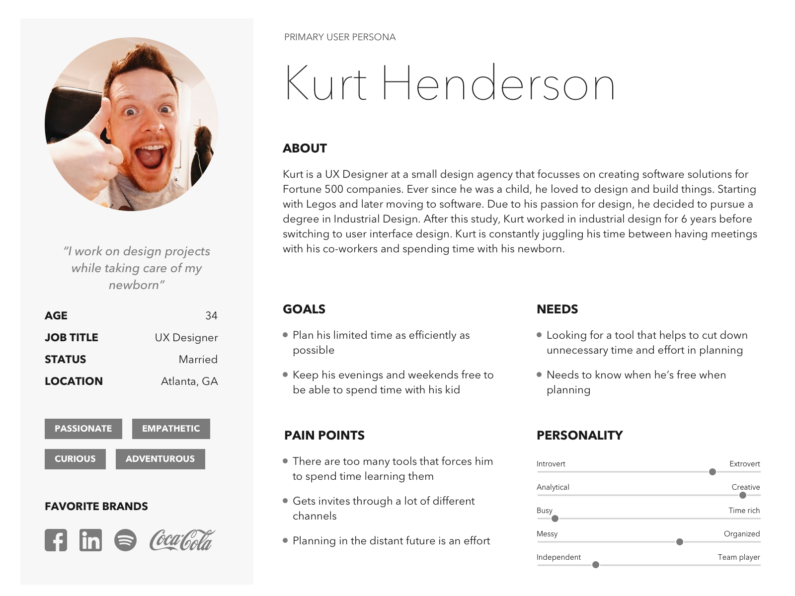

---

## Initial Ideation Sketches

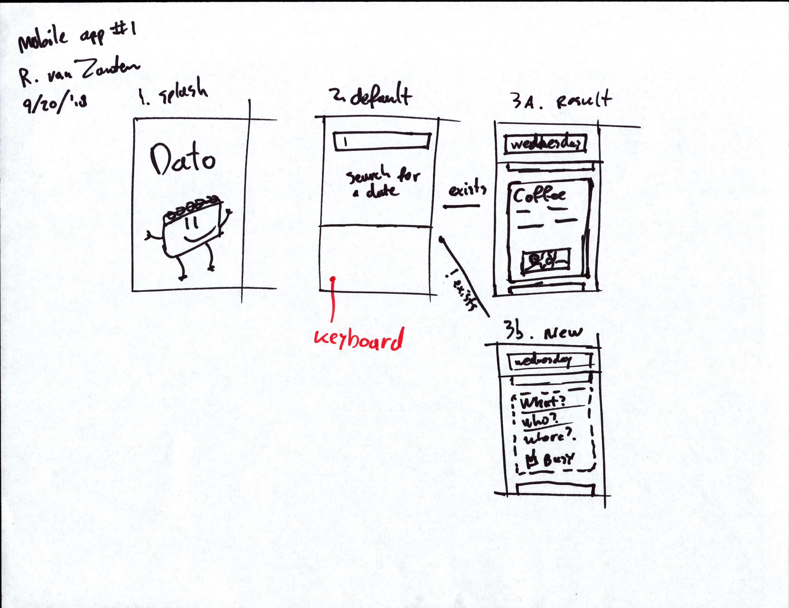 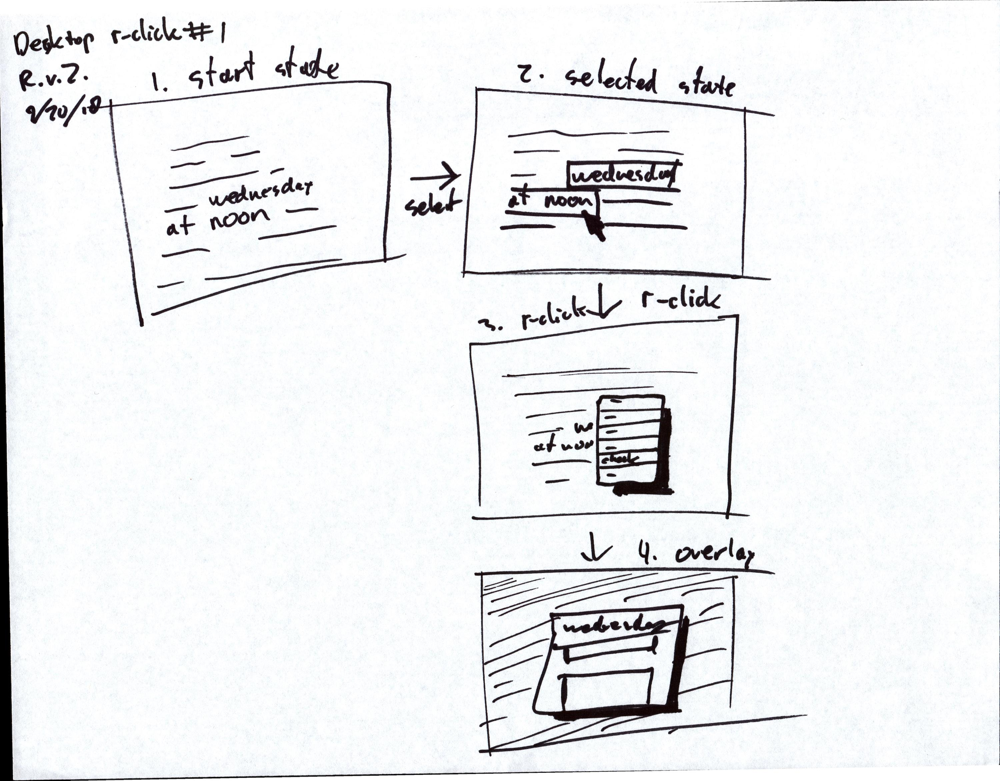 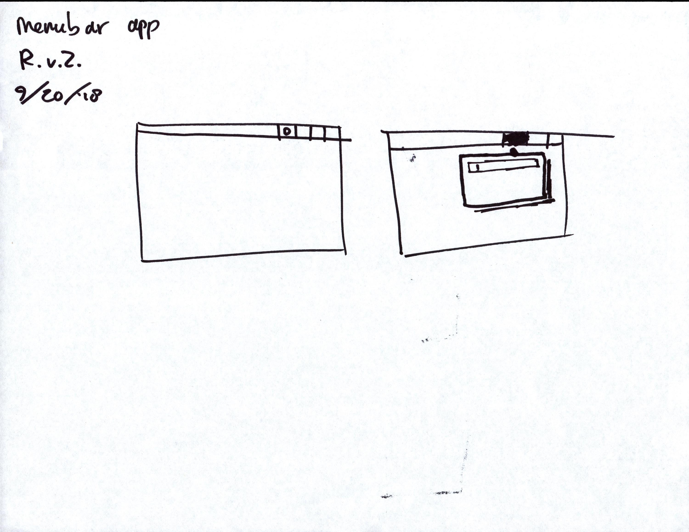

---

## Initial Ideation Sketches #2

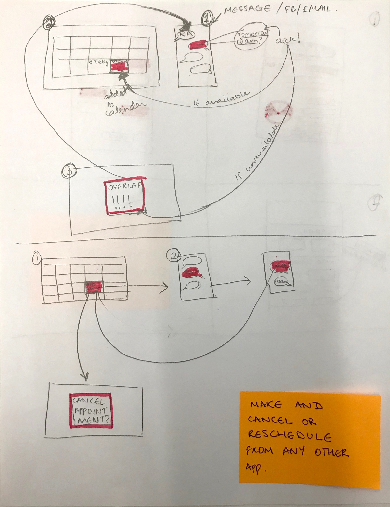 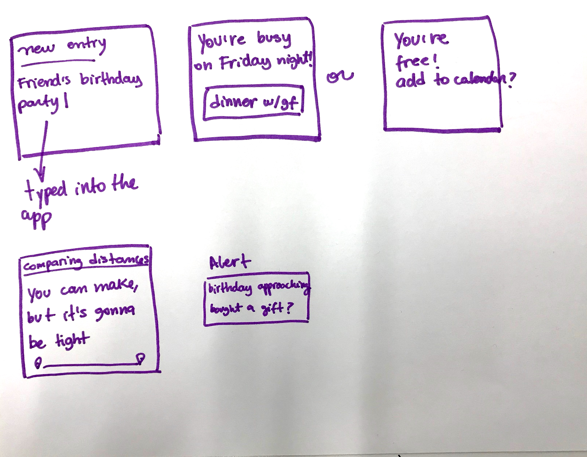

---

## Conclusion

* Use "Quick Event" interface as starting point
* Make available in any app w/ shortcut, right-click option, and menubar toggle
* Re-use familiar "event-add popup" for visual consistency

---

## Low-fi sketch #1

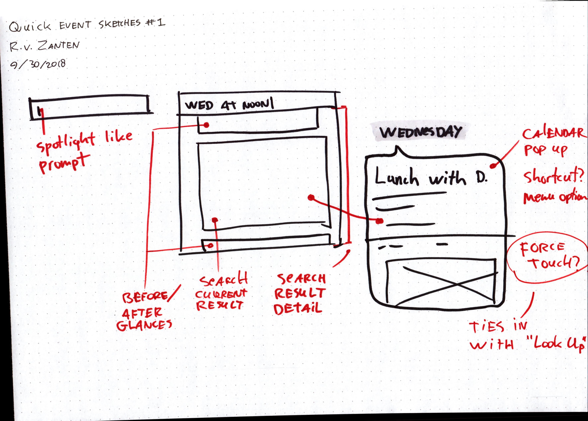

---

## Low-fi sketch #2

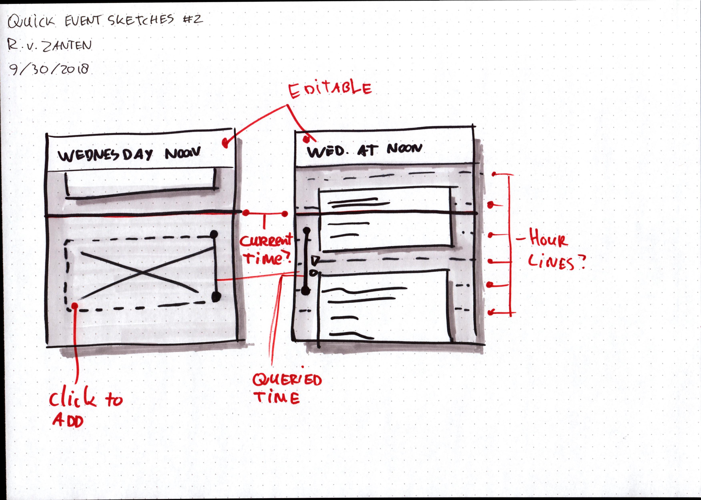

---

## Low-fi sketch #3

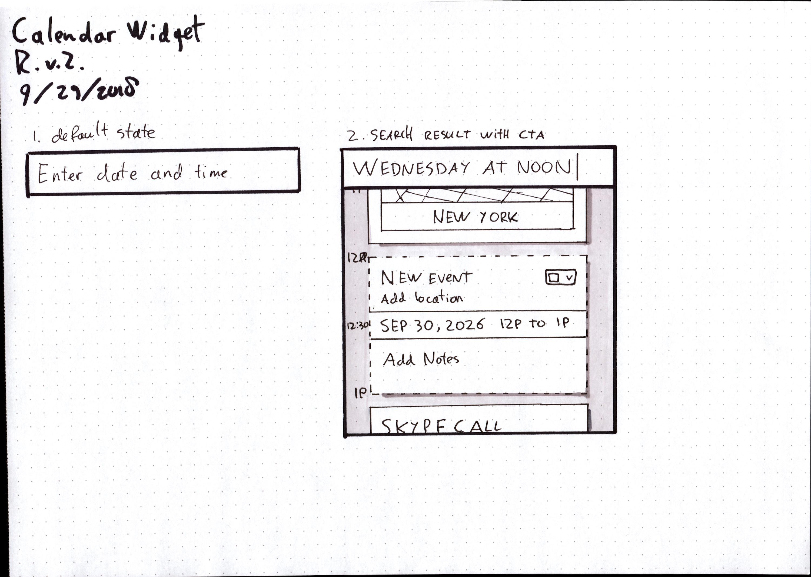