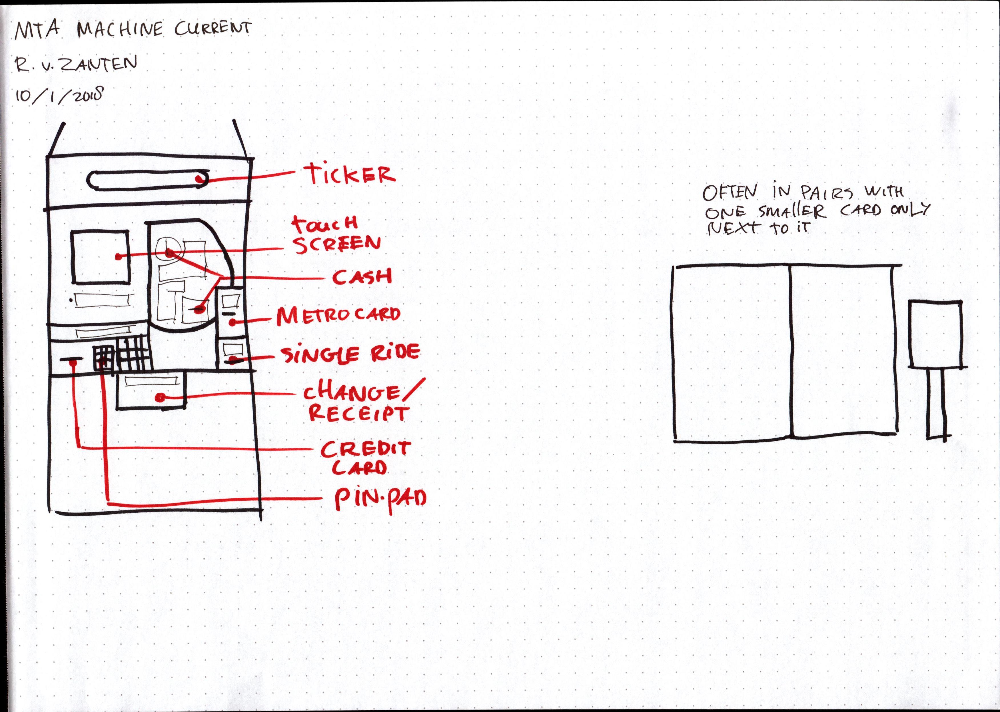
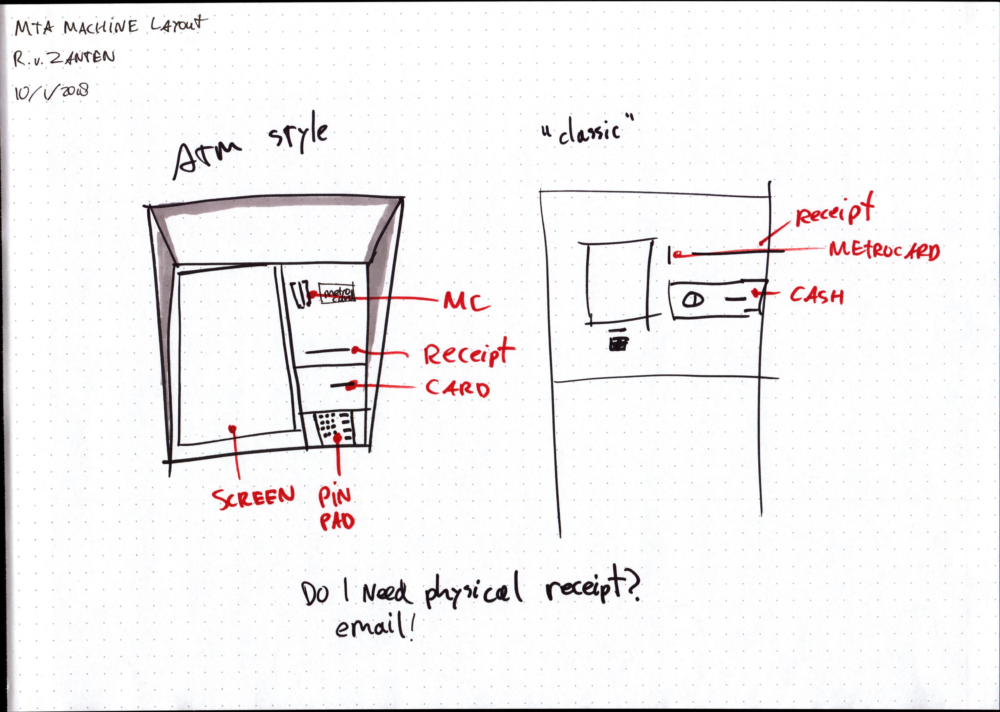
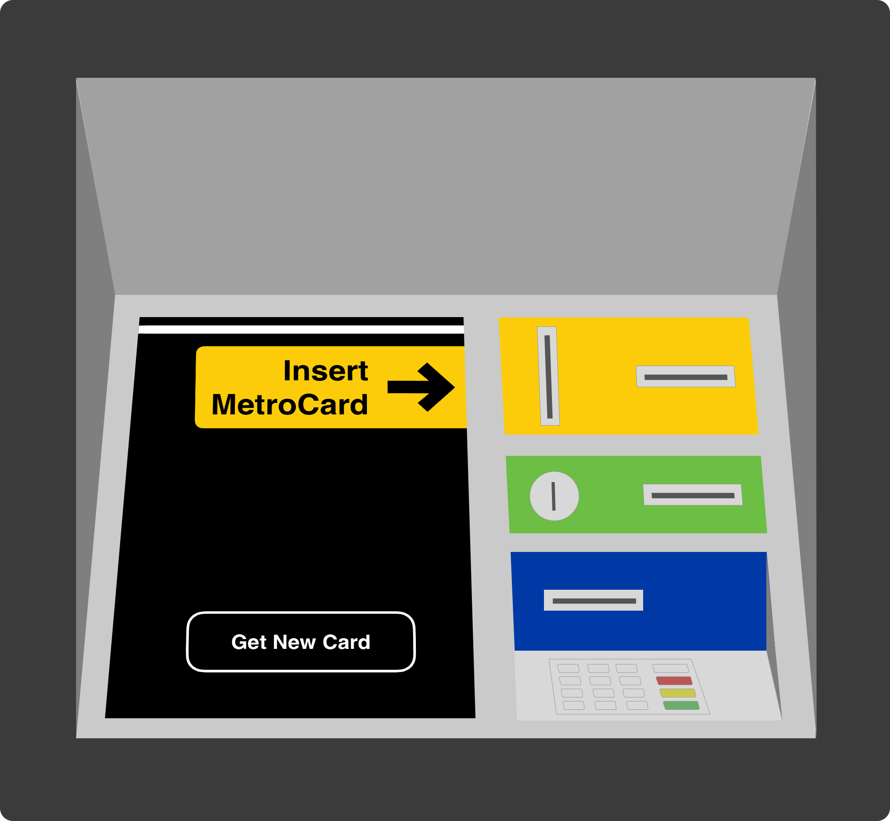
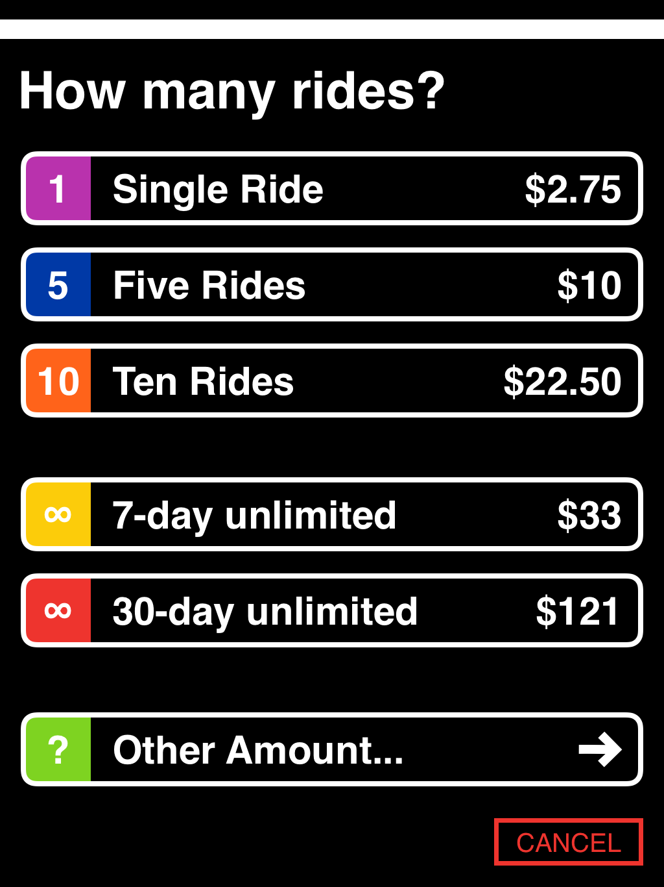

footer: Rijk van Zanten
slidenumbers: true

# Subway Interventions

---
[.build-lists: true]

## Wayfinding

* People going everywhere
* Very chaotic

### Turns out that

* Most people go straight to their destination
* System in place works

---

## Ticket machines

---

# Getting tickets is painful

---

## Problems:

* Machine layout
* Product confusion
* Cumbersome flow

---

## Machine layout solution

 

---

## Machine Layout Solution

---

## Product Confusion Solution

* What do people want?
  Ride the subway
* What do you need to do it?
  A MetroCard
* What do you want to buy?
  _N_ subway rides

---

## Product Confusion Solution

---

## Confusing Flow

---

## Confusing Flow Solution

---

# Thanks!

## Checkout rijks.website for more info!

